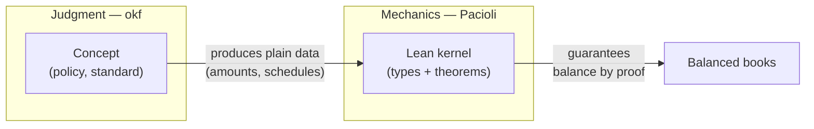
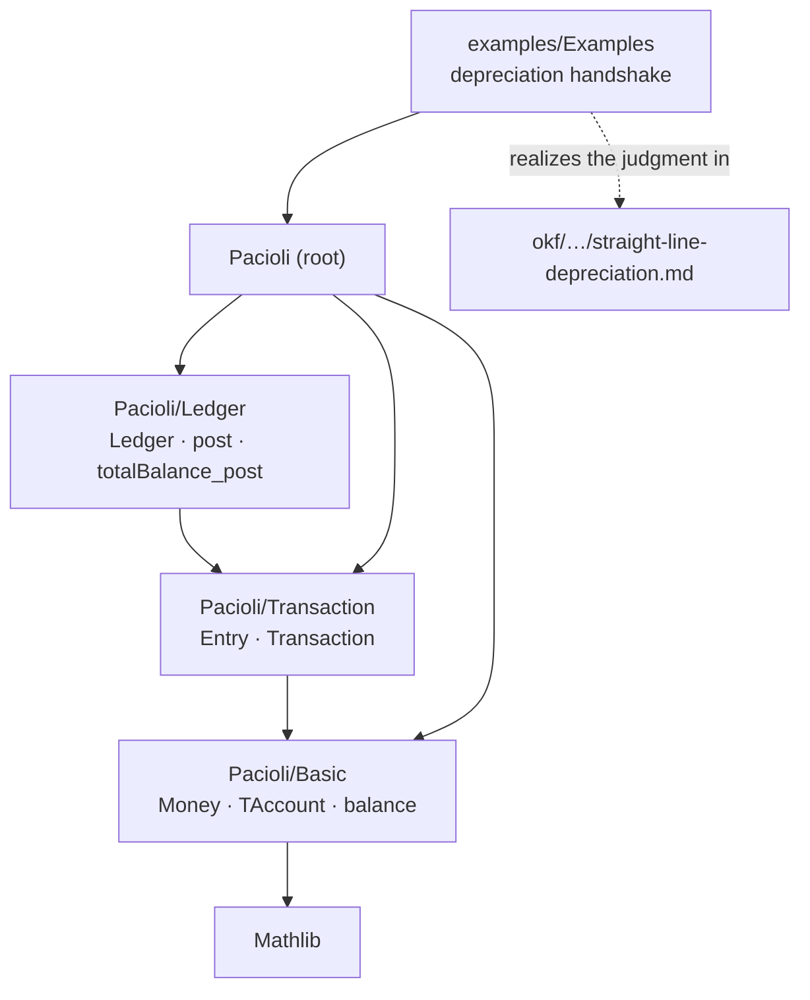
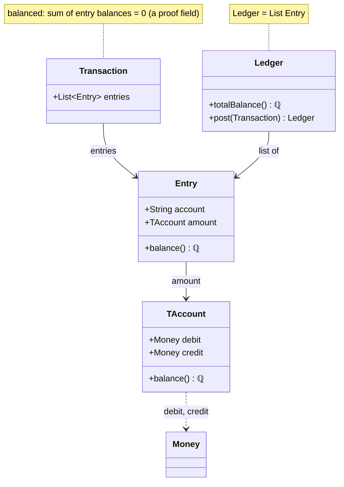
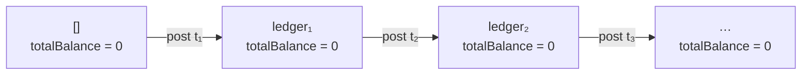
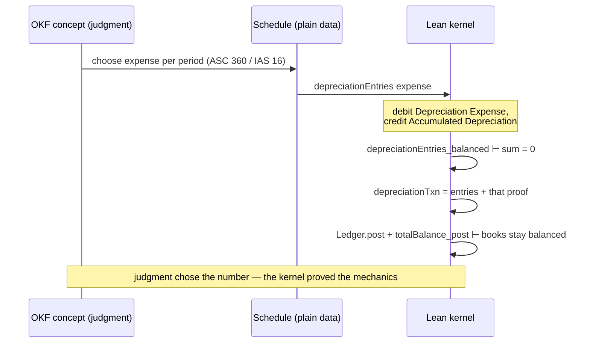

# Pacioli architecture

_What exists in Pacioli and how the pieces relate._

This document maps the current codebase and the relationships between its parts.
It is the **structural** companion to the [README](../README.md), which carries
the _why_. Per-definition detail lives in the Lean docstrings; this document
explains how those definitions fit together.

Where a line references a type or theorem, it exists in the file named beside it.

---

## The halves

Pacioli is split into a **mechanical core** (proven in Lean) and a **judgment
bundle** (curated in OKF). They meet at exactly one seam: judgment produces
plain _data_, and the kernel consumes that data and proves the mechanics.



The rule that keeps the seam clean: **policy never leaks into Lean types.** If a
Lean type could only be built by making a policy choice, that choice belongs in
OKF instead.

---

## Repository map

| Path                                         | Role                                                   |
| -------------------------------------------- | ------------------------------------------------------ |
| `Pacioli.lean`                               | Library root; imports the three kernel modules         |
| `Pacioli/Basic.lean`                         | `Money`, `TAccount`, and the `balance` valuation       |
| `Pacioli/Transaction.lean`                   | `Entry` and the balanced `Transaction`                 |
| `Pacioli/Ledger.lean`                        | `Ledger`, `post`, and the fundamental invariant        |
| `examples/Examples.lean`                     | The OKF → data → kernel handshake, verified end to end |
| `okf/index.md`                               | Judgment bundle entry point                            |
| `okf/concepts/straight-line-depreciation.md` | One curated concept (the judgment behind the example)  |

### Module dependency graph

Arrows point from a module to what it imports.



---

## The mechanical core

### The type stack

The kernel defines five types, each adding exactly one idea: a value (`Money`),
an account (`TAccount`), a posting (`Entry`), a balanced bundle of postings
(`Transaction`), and the journal they accumulate in (`Ledger`).



- **`Money := ℚ≥0`** — non-negative rationals. Chosen over `ℝ` (not computable,
  no decidable equality) and floats (rounding). Amounts are non-negative _by
  type_. (`Pacioli/Basic.lean`)
- **`TAccount { debit, credit }`** — an ordered pair of `Money`. This is exactly
  an element of Ellerman's _Pacioli group_ (see below). Gross debit and credit
  are kept intact rather than collapsed to a net. (`Pacioli/Basic.lean`)
- **`Entry { account, amount }`** — a single posting: a `TAccount` amount
  applied to a named account. (`Pacioli/Transaction.lean`)
- **`Transaction { entries, balanced }`** — a list of entries _plus a proof_
  that their balances sum to zero. (`Pacioli/Transaction.lean`)
- **`Ledger := List Entry`** — the journal of everything posted.
  (`Pacioli/Ledger.lean`)

### The Pacioli group and the `balance` homomorphism

A `TAccount` is an element of the **group of differences** built from pairs of
non-negative numbers — the structure Ellerman calls the _Pacioli group_.
`balance` is the map that sends a T-account to its net signed value:

```text
balance t  :=  t.debit − t.credit        (into ℚ)
```

`balance` is not just a function — it is a **group homomorphism** from
`(TAccount, +, 0)` into `(ℚ, +, 0)`. That is captured by two identities the
kernel proves:

```text
  (a, b) ──────( + )──────► a + b            balance is a group homomorphism
    │                         │                (TAccount, +, 0) ⟶ (ℚ, +, 0)
 balance                   balance
    │                         │              balance 0        = 0
    ▼                         ▼                                        (balance_zero)
 bal a, bal b ─( + )─► bal a + bal b  ∈ ℚ    balance (a + b)  = balance a + balance b
                                                                      (balance_add)
```

The square **commutes**: adding two T-accounts and then taking the balance gives
the same rational as taking each balance and then adding. This is `balance_add`,
and it is why balancing composes — the balance of a whole is the sum of the
balances of its parts. Every higher-level guarantee rests on it.

### The balancing obligation

A `Transaction` carries its balance proof as a **field**:

```text
balanced : (entries.map Entry.balance).sum = 0
```

Because the proof is part of the value, an unbalanced transaction is not merely
discouraged — it **cannot be constructed**. This is "make illegal states
unrepresentable" in action: the type system rejects unbalanced books before any
runtime check runs. (`Pacioli/Transaction.lean`)

### The fundamental invariant

The ledger's health is one number: `totalBalance`, the sum of every entry's
balance. Two theorems pin it to zero forever:



- **`totalBalance_nil`** — the empty ledger has total balance `0` (the base
  case).
- **`totalBalance_post`** — posting a (balanced) transaction leaves the total
  balance _unchanged_ (the step).

Together they give the **trial balance identity by construction**: every ledger
reachable from empty by posting balanced transactions has total balance `0` —
equivalently, its total debits equal its total credits. Because `Transaction`
cannot exist unless it is balanced, and `post` is the only way to grow a ledger,
there is no reachable state in which the books do not balance — and it holds by
proof, not by a runtime assertion. (`Pacioli/Ledger.lean`)

### Why this is _not_ the accounting equation

It is tempting to call `totalBalance = 0` the accounting equation. It is not,
and the difference is exactly the seam this project cuts on.

| | Statement | What it needs |
| --- | --- | --- |
| **Trial balance identity** | total debits = total credits | nothing but the postings — **proved today** |
| **Accounting equation** | assets = liabilities + equity | every account **classified** — not stated today |

`totalBalance` sums over _every_ entry indiscriminately. To even write `assets =
liabilities + equity` you must first know which accounts are assets — and that
is a _classification_, which the seam rule sends to judgment (`okf/`), not to a
Lean type. So the accounting equation is not a stronger theorem the kernel has
yet to prove; it is a statement the kernel currently **cannot express**, by
design.

When it does arrive it will arrive in the two pieces the seam predicts: an OKF
concept supplying the classification as plain data, and a mechanical theorem
that any _partition_ of the accounts has part-sums totalling `0`. The identity
above is the one-part case of that theorem.

---

## The judgment half and the interface contract

The mechanical core deliberately knows nothing about _why_ any amount is what it
is. That "why" is judgment, and it lives in the OKF bundle under `okf/`, one
markdown concept per file. A concept explains _what_ the accounting inputs
should be and _why_, and produces **data** — an amount, a schedule, a
classification — that the kernel then consumes deterministically.

The handshake is the whole design, stated once:

> An OKF concept encodes a **judgment** → the judgment produces **inputs**
> (plain data) → the Lean kernel consumes those inputs **deterministically** and
> guarantees the mechanics.

---

## Worked example: straight-line depreciation

`examples/Examples.lean` walks one concept across the seam end to end. The
judgment (how to spread an asset's cost over its useful life) lives in
`okf/concepts/straight-line-depreciation.md`; the kernel proves the resulting
postings balance, without knowing _why_ the expense is what it is.



The final `example` in that file discharges the goal directly with
`Ledger.totalBalance_post` — the depreciation posting inherits the kernel's
fundamental invariant for free. Whatever expense the judgment picks, the books
stay balanced.

---

## Identity & theorem reference

Every load-bearing fact in the demo, with where it lives. These are the
foundational debit/credit identities the kernel is built from.

| Name                           | Statement                                             | Meaning                                                       | Source                     |
| ------------------------------ | ----------------------------------------------------- | ------------------------------------------------------------- | -------------------------- |
| `TAccount.balance`             | `balance t = t.debit − t.credit`                      | An account's net signed value (the group's quotient map)      | `Pacioli/Basic.lean`       |
| `balance_zero`                 | `(0 : TAccount).balance = 0`                          | The zero account is balanced (identity ↦ identity)            | `Pacioli/Basic.lean`       |
| `balance_add`                  | `(a + b).balance = a.balance + b.balance`             | `balance` is additive — a group homomorphism                  | `Pacioli/Basic.lean`       |
| `Transaction.balanced`         | `(entries.map Entry.balance).sum = 0`                 | Debits equal credits; a field, so unbalanced txns can't exist | `Pacioli/Transaction.lean` |
| `totalBalance_nil`             | `totalBalance [] = 0`                                 | The empty ledger balances (base case)                         | `Pacioli/Ledger.lean`      |
| `totalBalance_post`            | `(l.post t).totalBalance = l.totalBalance`            | Posting preserves total balance (inductive step)              | `Pacioli/Ledger.lean`      |
| `depreciationEntries_balanced` | `((depreciationEntries e).map Entry.balance).sum = 0` | The example's per-period postings balance                     | `examples/Examples.lean`   |

---

## What's here, and what's next

**Here today:** the group-theoretic foundation (`TAccount` as a Pacioli-group
element, `balance` as a homomorphism), the unrepresentable-by-construction
`Transaction`, the fundamental ledger invariant, and one worked concept crossing
the OKF → kernel seam. That is enough to demonstrate the whole architecture on a
real accounting operation.

**Not yet:** aggregation/rollup across accounts, account taxonomies
(asset/liability/equity/income/expense) and the accounting equation they unlock,
period close and its sum-preserving proof, and more OKF concepts. Each new input
is either _mechanical_ (a Lean invariant in `Pacioli/`) or _judgment_ (an OKF
concept in `okf/`) — never both — so the seam above is the map for everything
that comes next.
