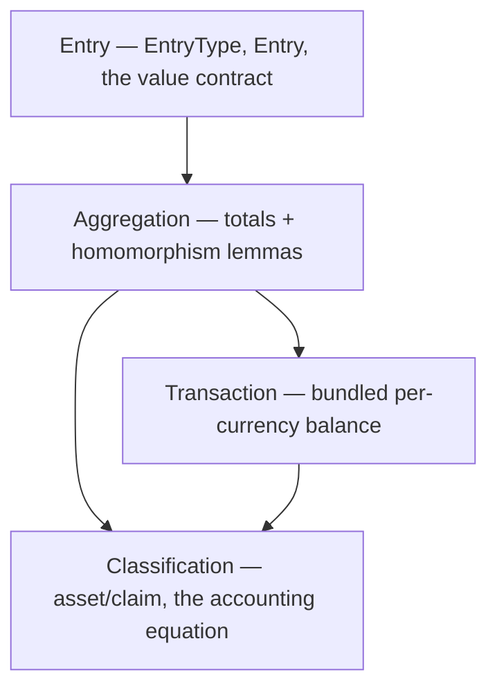

# The mechanics, in code

_A module-by-module map of the Lean library. For the motivation and the
mechanical/judgment thesis, see the [README](../README.md)._

The mechanical half is a Lean 4 library, `Pacioli`, in four modules. Each
depends only on those before it, so the picture is a small dependency graph from
raw data up to the accounting equation (arrows point from a module to those that
build on it):

## The modules

- **`Entry`** — the raw data. `EntryType` is a posting's direction (debit or
  credit); `Entry` bundles an `account`, `currency`, `value`, `direction`, and
  `time`. Account, currency, value, and time are all abstract type parameters —
  their representation is the caller's, never the kernel's. This module also
  fixes the **value contract**: a value is a nonnegative, ordered, additive
  magnitude, so negative money is unrepresentable and direction cannot hide in a
  sign.
- **`Aggregation`** — the calculus of totals. `totalBy` (and `totalDebits` /
  `totalCredits`) sum the value of a list of entries by currency and direction,
  and its lemmas prove these totals are a **list homomorphism**: empty list to
  `0`, concatenation to `+`, invariant under reordering. Everything downstream
  leans on these.
- **`Transaction`** — a list of entries bundled with a proof that it **balances
  per currency** (total debits equal total credits, in each currency). Because
  the proof is a field of the type, an unbalanced transaction cannot be
  constructed at all. This is the _trial-balance identity_ (Pacioli, 1494).
- **`Classification`** — where the mechanics meet judgment. A fixed, mechanical
  taxonomy (`AccountClass` = asset or claim; a claim is a liability or equity)
  plus the normal-balance convention; the account-to-class assignment enters as
  a judgment parameter `classify`. On top sits the **accounting equation**:
  every balanced transaction moves assets and claims by equal amounts
  (`Δassets = Δclaims`) — a corollary of balance.

## Where the seam is

Everything the kernel touches is a total function of explicit data. The judgment
inputs are exactly the abstract type parameters (which chart of accounts, which
currencies, how money and time are represented) and the `classify` function —
and every theorem holds for _any_ choice of them. No policy is baked into a
type; that is the whole design.

## How the proofs stack

`Transaction` makes imbalance unrepresentable; `Aggregation` shows the totals
compose as a homomorphism; and `Classification` combines the two — the
accounting equation is just the trial-balance identity, re-partitioned by the
classification. Each layer is a small, fully-proven increment.
